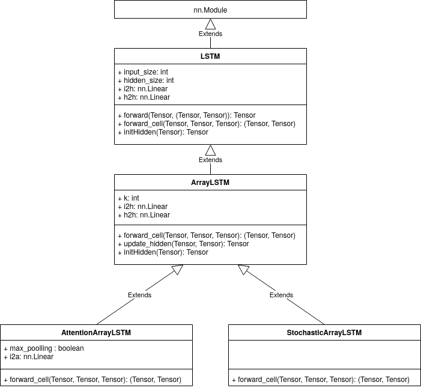
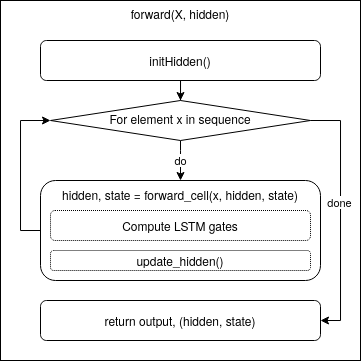

Overview
========
This section explains the modular design of ArrayLSTM on a high level.
Figure 1 provides an overview of the different modules used in the ArrayLSTM implementation.

    Figure 1: Overview of modules in class diagram.
    Note that this diagram only contains attributes and methods that are overwritten in the respective classes.

All LSTM variants are subclasses of the :py:class:`nn.Module` class.
Therefore, they all implement the :py:class:`forward(X, hidden)` method.
Or alternatively, the class implements the :py:meth:`__call__` method, which subsequently calls the :py:class:`forward(X, hidden)` method.
Figure 2 gives an overview of how the forward method is implemented.
Note that the dashed block :py:meth:`update_hidden` is only called in the ArrayLSTM variants, not the regular LSTM.

    Figure 2: Control flow graph of methods called for each sequence.
    Note that the update_hidden() method is only called in the ArrayLSTM variants, not the regular LSTM.
